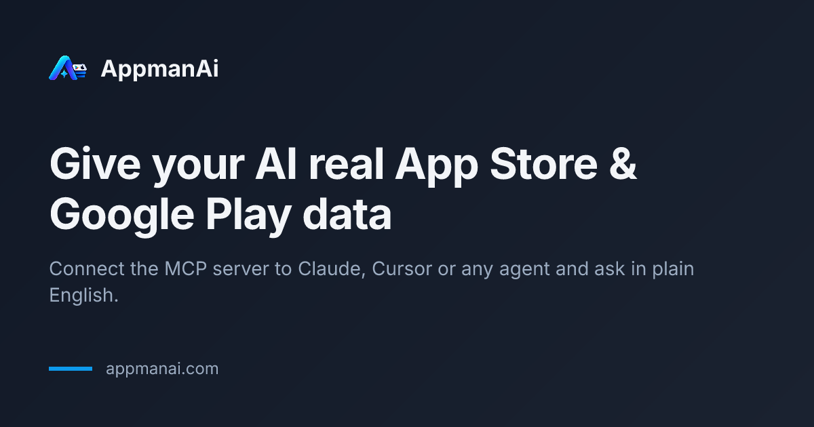
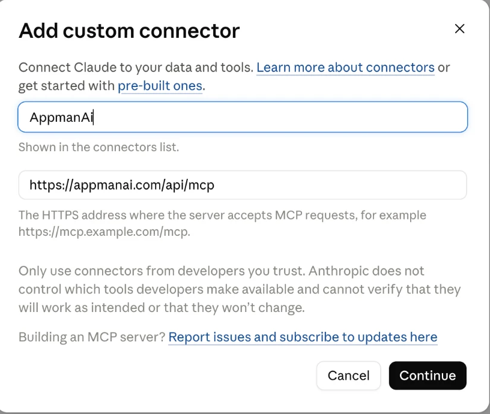
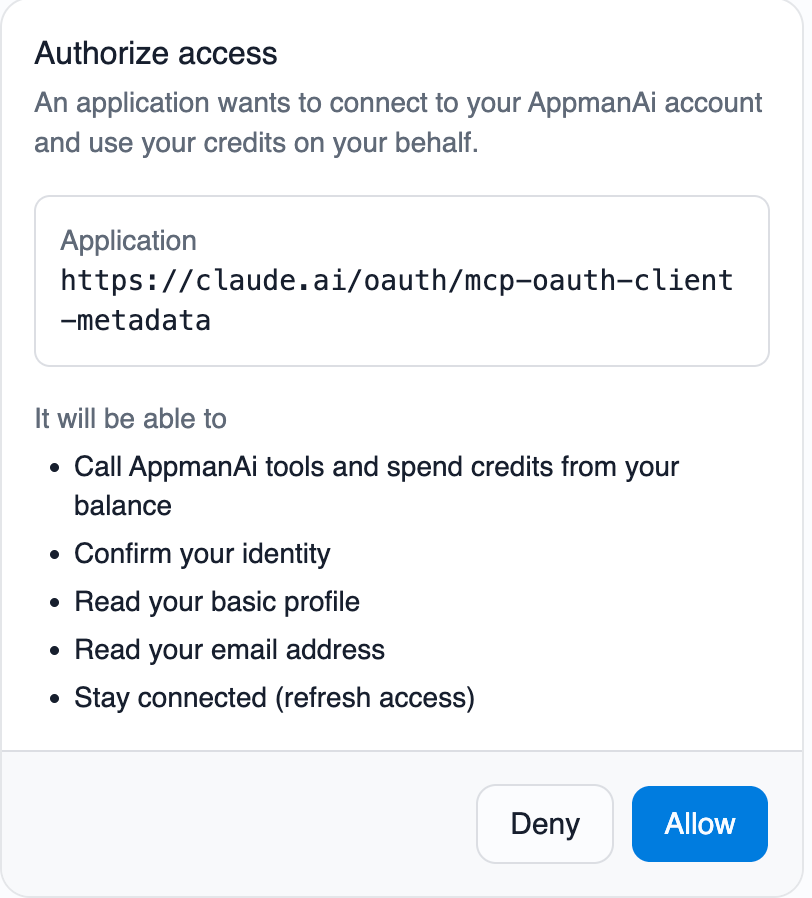
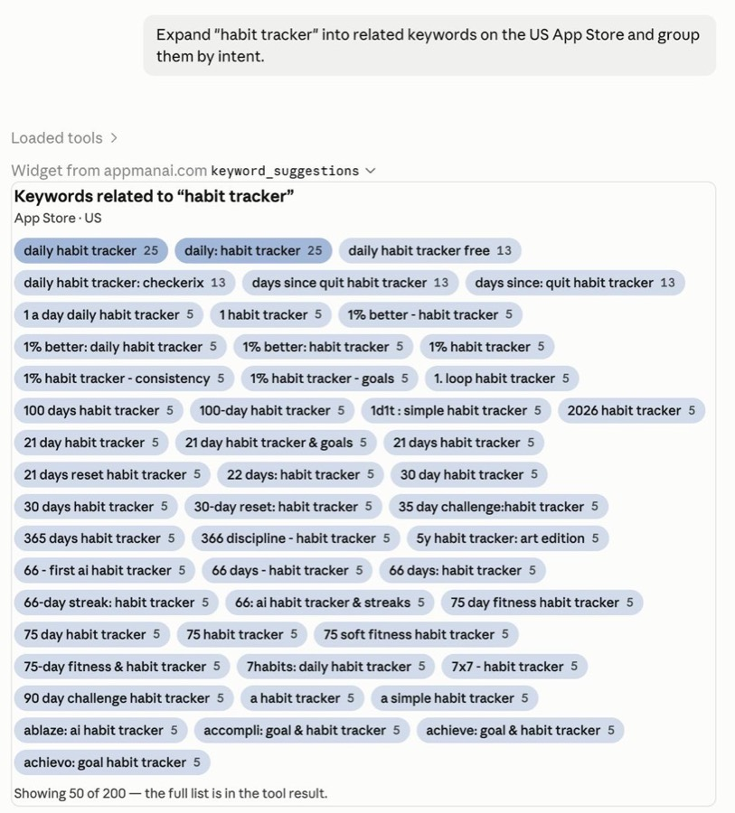

<div align="center">



# AppmanAi MCP

Keyword demand, rank history, top charts, competitors, reviews and ratings —
across **100+ countries**, answered inside your chat instead of a dashboard.

[](https://appmanai.com)
[](https://appmanai.com/docs/)
[](#tools)
[](LICENSE)

<br>

[](https://claude.ai/customize/connectors?modal=add-custom-connector&connectorName=AppmanAi&connectorUrl=https%3A%2F%2Fappmanai.com%2Fapi%2Fmcp)
[](https://cursor.com/en/install-mcp?name=appmanai&config=eyJ1cmwiOiAiaHR0cHM6Ly9hcHBtYW5haS5jb20vYXBpL21jcCJ9)
[](https://insiders.vscode.dev/redirect/mcp/install?name=appmanai&config=%7B%22type%22%3A%20%22http%22%2C%20%22url%22%3A%20%22https%3A%2F%2Fappmanai.com%2Fapi%2Fmcp%22%7D)

</div>

---

## Without AppmanAi

Ask an assistant about your app's market and it answers from training data — a snapshot
of some stores, some countries, some year ago:

- Keyword advice with no idea what people actually search for
- "Competitors" it inferred from a name rather than the store's own graph
- Rank claims it cannot check, stated with the same confidence as facts
- Nothing at all for the 90+ countries outside the US

## With AppmanAi

Your agent calls the stores. Every number in the answer came back from a live query, and
the agent tells you what each call cost.

```txt
Which keywords do my three UK competitors rank top-10 for that I don't?
```

```txt
Profile the keyword "habit tracker" on the US App Store — is it worth chasing?
```

```txt
My rank for "meditation" dropped 12 places last week. Was that me, or the algorithm?
```

```txt
What do users actually complain about in the reviews of com.example.app?
```

```txt
Where in the world does "budget planner" have enough demand to justify a launch?
```

---

## Install

AppmanAi is a **remote MCP server**. There is nothing to download and no API key to paste —
you add one URL, sign in, and the tools appear:

```
https://appmanai.com/api/mcp
```

Authentication is OAuth 2.1: your client opens a browser, you approve once, and it stores
the token. **New accounts get 200 free credits, no card.**

<table>
<tr><th align="left">Client</th><th align="left">How</th></tr>
<tr>
<td><b>Claude</b><br><sub>web · desktop · mobile</sub></td>
<td>

[**Add AppmanAi to Claude →**](https://claude.ai/customize/connectors?modal=add-custom-connector&connectorName=AppmanAi&connectorUrl=https%3A%2F%2Fappmanai.com%2Fapi%2Fmcp)

Or: *Settings → Connectors → Add custom connector*, paste the URL, **Allow**.

</td>
</tr>
<tr>
<td><b>Claude Code</b></td>
<td>

```bash
claude mcp add --transport http appmanai https://appmanai.com/api/mcp
```

</td>
</tr>
<tr>
<td><b>Cursor</b></td>
<td>

[**One-click install →**](https://cursor.com/en/install-mcp?name=appmanai&config=eyJ1cmwiOiAiaHR0cHM6Ly9hcHBtYW5haS5jb20vYXBpL21jcCJ9) · or add to `mcp.json`:

```json
{ "mcpServers": { "appmanai": { "url": "https://appmanai.com/api/mcp" } } }
```

</td>
</tr>
<tr>
<td><b>VS Code</b></td>
<td>

[**One-click install →**](https://insiders.vscode.dev/redirect/mcp/install?name=appmanai&config=%7B%22type%22%3A%20%22http%22%2C%20%22url%22%3A%20%22https%3A%2F%2Fappmanai.com%2Fapi%2Fmcp%22%7D) · or add to `mcp.json`:

```json
{ "servers": { "appmanai": { "type": "http", "url": "https://appmanai.com/api/mcp" } } }
```

</td>
</tr>
<tr>
<td><b>Codex</b></td>
<td>

```bash
codex mcp add appmanai --url https://appmanai.com/api/mcp
```

</td>
</tr>
<tr>
<td><b>Gemini CLI</b></td>
<td>

```bash
gemini mcp add appmanai https://appmanai.com/api/mcp --transport http
```

</td>
</tr>
<tr>
<td><b>Anything else</b></td>
<td>

Bridge it over stdio with [`mcp-remote`](https://www.npmjs.com/package/mcp-remote):

```json
{ "mcpServers": { "appmanai": { "command": "npx", "args": ["-y", "mcp-remote", "https://appmanai.com/api/mcp"] } } }
```

</td>
</tr>
</table>

<details>
<summary><b>What the three steps look like</b></summary>

<br>

**1 · Paste the URL as a custom connector**



**2 · Sign in and click Allow**



**3 · The tools answer in chat**



</details>

---

## Tools

35 read-only tools. Costs are in credits and are the **real** numbers the server charges —
this section is generated from the live catalogue by
[`scripts/generate-tool-table.mjs`](scripts/generate-tool-table.mjs), so what is published
here cannot drift from what you are billed.

<!-- tools:start -->

<details>
<summary><b>Apps</b> — 7 tools, 2–8 credits</summary>

| Tool | Credits | What it does |
| --- | ---: | --- |
| `app_search` | 2 | Search a store for apps matching a name or phrase. Returns matching apps with their package ids — the way to resolve a name into a package id for the other tools. |
| `app_similar` | 5 | List the apps the store itself considers similar to a given app (title, developer, icon). The quickest way to build a competitor set from one seed app. |
| `app_metrics_metadata` | 3 | Fetch the full store listing for one app (title, developer, ratings, category, metadata) by its package id. If you only have the app name, call app_search first to resolve it. |
| `app_metrics_metadata_batch` | 8 | Fetch store listings for a list of package ids in one call — the bulk form of app_metrics_metadata. Use it when comparing apps, instead of one call per app. |
| `app_metrics_ratings_worldwide` | 6 | An app's current rating and per-star vote counts in every country it is listed in. Use it to see where an app is rated well or badly; app_metrics_ratings_history tracks one country over time. |
| `app_metrics_ratings_history` | 5 | An app's average rating and star breakdown over time in one country — a dated series for charting whether a release helped or hurt. app_metrics_ratings_worldwide gives the current picture across all countries instead. |
| `app_reviews` | 4 | Read real user reviews of an app: author, star rating, text and date. Use it to find out what users actually complain about or praise. |

</details>

<details>
<summary><b>Keywords by app</b> — 7 tools, 2–12 credits</summary>

| Tool | Credits | What it does |
| --- | ---: | --- |
| `keyword_app_metrics_rankings` | 2 | Where one app currently ranks in search results for one keyword. The direct answer to "am I ranking for this?". A rank of 0 means the app is not in the results. |
| `keyword_app_metrics_rankings_batch` | 9 | One app's rank for a list of keywords in a single call. Use it to check a whole keyword set at once instead of calling keyword_app_metrics_rankings repeatedly. A rank of 0 means the app is not in the results. |
| `keyword_app_metrics_rankings_history` | 6 | One app's rank for a keyword over time — the series to chart when asking whether a change helped. Pick the window with `period`. A rank of 0 means the app is not in the results. |
| `keyword_app_metrics_rankings_worldwide` | 12 | One app's rank for a keyword in every country at once. Use it to find the markets where the app already ranks, before spending calls per country. A rank of 0 means the app is not in the results. |
| `keyword_app_suggestions` | 6 | List the keywords a specific app is recommended for / ranks on in a store/country, by its package id. The direct way to answer "what keywords does this app rank for?". If you only have the app name, call app_search first to resolve it. A rank of 0 means the app is not in the results. |
| `keyword_app_competitors` | 6 | List keywords that the competitors of one app rank for, with their popularity (SAP) and that app's own rank where it has one. Use it to find the gaps — keywords rivals own and this app does not. keyword_app_suggestions covers what the app itself already ranks for. |
| `keyword_app_overlap` | 7 | Given a set of apps, list the keywords they compete on, each with its popularity (SAP) and every app's rank for it. Use it to compare a whole competitor set head-to-head on one keyword list; keyword_app_competitors starts from a single app instead. |

</details>

<details>
<summary><b>Keywords</b> — 8 tools, 4–12 credits</summary>

| Tool | Credits | What it does |
| --- | ---: | --- |
| `keyword_metrics` | 4 | Get the ASO profile of a keyword: search-ads popularity (SAP), difficulty, and languages. Use it to judge whether a keyword is worth targeting. |
| `keyword_metrics_sap` | 4 | Get just the search-ads popularity (SAP, 0-100) of one keyword in a country, across both stores. The cheapest popularity check; keyword_metrics adds difficulty and languages. |
| `keyword_metrics_sap_batch` | 9 | Get the search-ads popularity (SAP) of many keywords in one call. Use it to rank a whole keyword list by demand before profiling the promising ones. |
| `keyword_metrics_volatility` | 8 | How much the store's ranking algorithm moved in one country over a period. High volatility means rank changes are the store's doing, not yours — check it before blaming a release. |
| `keyword_metrics_volatility_worldwide` | 12 | Ranking-algorithm volatility for one date across every country, so you can tell a global store change from a local one. |
| `keyword_top_apps` | 5 | List the apps that rank highest for a keyword in a store/country — the search results a user sees. Use it to find the incumbents / competitors for a keyword. |
| `keyword_suggestions` | 5 | Expand a seed keyword into related keyword suggestions for a store/country. Use it to grow a keyword list before profiling or checking ranks. |
| `keyword_suggestions_worldwide` | 10 | Expand a seed keyword into suggestions with their popularity (SAP), across all markets at once and without picking a store or country. The cheap first pass before narrowing down with keyword_suggestions or keyword_metrics. |

</details>

<details>
<summary><b>Charts and categories</b> — 5 tools, 2–6 credits</summary>

| Tool | Credits | What it does |
| --- | ---: | --- |
| `category_top_apps` | 5 | List the apps at the top of a category chart (top free, top grossing, top paid) in a country. Use it to see who leads a category; list_categories has the valid tags. |
| `app_category_rankings` | 3 | List every category chart an app currently appears in, with its rank in each. The place to start when you do not already know which chart matters. |
| `app_category_rankings_single` | 2 | An app's current position in a single category chart. Use it when you know exactly which chart you mean; app_category_rankings lists every chart the app appears in. |
| `app_category_rankings_history` | 6 | An app's position in a category chart across past days — the series to chart when asking whether an app is climbing or sliding. |
| `app_category_start_rankings` | 5 | For each app given, the rank it first held in a chart from a start date — the baseline to measure a campaign against. |

</details>

<details>
<summary><b>Generation</b> — 2 tools, 12–15 credits</summary>

| Tool | Credits | What it does |
| --- | ---: | --- |
| `generate_keywords` | 12 | Generate a keyword list for an app from its own store listing, each scored with its popularity (SAP) and the app's current rank where it has one. Use it to propose new keywords to target; keyword_app_suggestions reports what the app already ranks for. |
| `generate_app_metadata` | 15 | Rewrite an app store listing — title, short and long description — optimised for the keywords you pass and the store it targets. Takes the current copy directly, not a package id, so you can iterate on drafts; use app_metrics_metadata first if you want to start from a live listing. |

</details>

<details>
<summary><b>Reference (free)</b> — 3 tools, free</summary>

| Tool | Credits | What it does |
| --- | ---: | --- |
| `list_countries` | free | List the countries AppmanAi covers, with languages and per-store support levels. Use it to confirm coverage or resolve a country code before other calls. |
| `list_categories` | free | List a store's category tree — category tags and the charts under each (top free, top grossing, top paid). Call it to get the exact tags the category tools take. |
| `list_features` | free | List which parts of the dataset are available for a store and country. Use it to check whether a kind of data exists for a market before spending credits looking for it. |

</details>

<details>
<summary><b>Account (free)</b> — 3 tools, free</summary>

| Tool | Credits | What it does |
| --- | ---: | --- |
| `user_balance` | free | Show the credit balance on the connected AppmanAi account, split into the monthly allowance and credits that never expire. |
| `user_api_usage` | free | Summarise this account's recent AppmanAi usage: credits spent, request count and a per-route breakdown over a window of days. |
| `list_tools` | free | List every AppmanAi tool with what it costs in credits, plus the current balance. Answers "what can you do?" and "what will this cost?". |

</details>
<!-- tools:end -->

Free tools stay available at a zero balance, so an agent can always check coverage and
its own budget.

---

## Slash commands

The server registers 32 prompts, which appear as slash commands in clients that support
them — `/appmanai:keyword_gap` in Claude, `/keyword_gap` in Cursor. Each one runs a whole
workflow from a couple of arguments.

<details>
<summary><b>All 32 commands</b></summary>

<br>

**Apps and competitors**

| Command | What it does |
| --- | --- |
| `/find_app` | Turn an app name into the package id everything else needs |
| `/app_profile` | Full store listing for one app in one country |
| `/similar_apps` | The competitor set the store itself considers adjacent |
| `/compare_apps` | Many package ids in one call — a competitor table |
| `/draft_metadata` | AI-written title, subtitle and description options |

**Keyword research**

| Command | What it does |
| --- | --- |
| `/expand_keyword` | Grow one seed into related terms real users type |
| `/keyword_profile` | Popularity, difficulty and language coverage for a term |
| `/keyword_popularity` | The raw search-ads demand number for a term |
| `/score_keywords` | SAP for a whole list — prune a brainstorm to a shortlist |
| `/keyword_worldwide` | Where in the world a term actually has demand |
| `/app_keywords` | The recommended keyword set for one app |
| `/generate_keywords` | AI keyword ideas when the obvious terms are saturated |
| `/competitor_keywords` | The terms your rivals already own |
| `/keyword_gap` | Classic gap analysis — what they rank for and you don't |

**Rank tracking**

| Command | What it does |
| --- | --- |
| `/keyword_rank` | One app, one keyword, one country |
| `/rank_history` | The dated series behind a position |
| `/rank_report` | One app across a whole keyword list |
| `/keyword_leaders` | The incumbents you would have to displace |
| `/rank_worldwide` | One keyword across every covered country |
| `/algorithm_check` | Was that move the store, or was it you? |
| `/algorithm_check_worldwide` | The same check across every country |

**Charts and categories**

| Command | What it does |
| --- | --- |
| `/top_charts` | The current leaderboard for a category and country |
| `/app_chart_ranks` | Every chart position one app holds |
| `/chart_position` | A single chart position — the cheapest check |
| `/chart_history` | Chart trajectory over time |
| `/launch_benchmark` | Where new apps actually enter the charts |

**Reviews and ratings**

| Command | What it does |
| --- | --- |
| `/app_reviews` | Raw reviews for an app |
| `/rating_breakdown` | The star histogram behind the average |
| `/rating_history` | How the average rating moved |

**Reference data**

| Command | What it does |
| --- | --- |
| `/check_coverage` | Which countries are covered, in what depth |
| `/category_ids` | The category ids the chart tools expect |
| `/feature_check` | What data exists per store and country |

</details>

Each is also listed, with its example prompts, in the
[prompt gallery](https://appmanai.com/prompts).

---

## Skills

[`skills/`](skills/) holds [Claude Skills](https://docs.claude.com/en/docs/agents-and-tools/agent-skills/overview) —
multi-step ASO workflows written on top of these tools. Copy a folder into
`.claude/skills/` and the workflow becomes available by name.

| Skill | What it produces |
| --- | --- |
| [`aso-keyword-audit`](skills/aso-keyword-audit) | A scored, prioritised keyword shortlist for one app in one market |
| [`competitor-gap`](skills/competitor-gap) | The keywords rivals own and you don't, ranked by reachability |
| [`rank-drop-triage`](skills/rank-drop-triage) | A verdict on whether a rank drop was your listing or the algorithm |
| [`review-mining`](skills/review-mining) | Recurring complaints and requests, grouped and sized |

They are plain Markdown, they only call the read-only tools above, and each step carries
its credit cost — read one before you run it.

---

## Pricing

Credits, billed per call. No subscription needed to start.

| | Free | Base |
| --- | --- | --- |
| Price | $0 | **$20 / month** or $200 / year |
| On signup | **200 credits**, no card | — |
| Every month | 100 credits | 1,000 credits |
| Top-up packs | — | ✓ |

**1 credit = $0.02.** A call costs 2–15 credits depending on how much work it is; the tool
table lists every one. Reference and account tools are always free.

Every tool result ends with your remaining balance, and `user_balance` reports it on
demand. Live numbers: [appmanai.com/pricing](https://appmanai.com/pricing).

---

## The HTTP API

The same data is a plain REST API, for when you would rather not go through an agent:

```bash
curl -G "https://appmanai.com/api/v1/keywords/metrics" \
  -H "Authorization: Bearer $APPMANAI_KEY" \
  --data-urlencode "store=ios" \
  --data-urlencode "country=US" \
  --data-urlencode "keyword=habit tracker"
```

[`openapi.yaml`](openapi.yaml) is the full, frozen spec — the same one the reference docs
and the typed clients are generated from. Runnable examples in
[`examples/`](examples/): [curl](examples/curl.sh),
[Python](examples/python/keyword_audit.py),
[TypeScript](examples/typescript/keyword-audit.ts).

[Quickstart](https://appmanai.com/docs/guide/quickstart.html) ·
[Authentication](https://appmanai.com/docs/guide/authentication.html) ·
[Rate limits](https://appmanai.com/docs/guide/rate-limits.html) ·
[Errors](https://appmanai.com/docs/guide/errors.html) ·
[Full reference](https://appmanai.com/docs/reference/)

---

## Coverage

Which countries, which stores, and how far back the history goes — published in full,
including the gaps: [appmanai.com/coverage](https://appmanai.com/coverage).

The `list_countries`, `list_categories` and `list_features` tools answer the same question
from inside a chat, for free. **Country missing?**
[Tell us](https://github.com/AppmanAI-com/AppmanAi-MCP/issues/new?template=data_request.yml) —
demand is how we pick what to crawl next.

---

## Support

- Bugs and requests: [open an issue](https://github.com/AppmanAI-com/AppmanAi-MCP/issues/new/choose)
- Anything else: [appman@appmanai.com](mailto:appman@appmanai.com)

The MCP server is hosted by us and is not open source. This repository holds the connector
manifest, the API spec, the skills and the examples — all MIT licensed. See [LICENSE](LICENSE).
